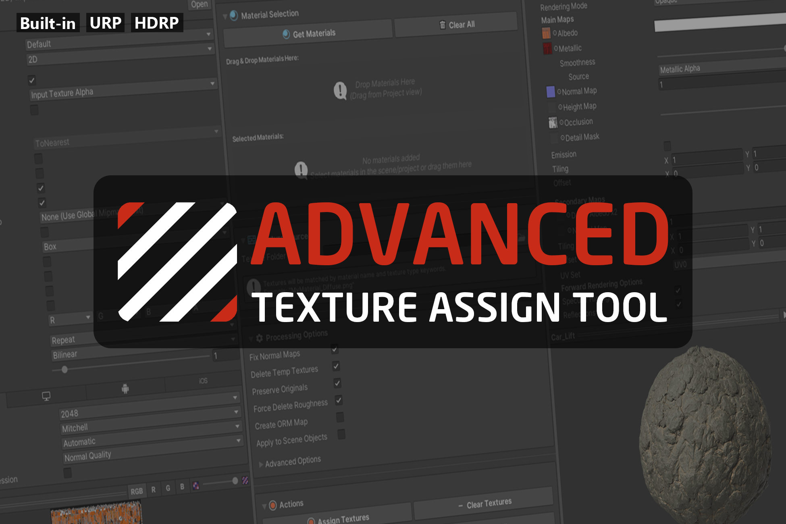

AdvancedTextureAssignTool
=============

**AdvancedTextureAssignTool** is a Unity editor tool that helps you quickly set up and assign textures to your materials. Instead of doing everything by hand, the tool finds, matches, and packs the right textures for you, no matter what shader you’re using. I use it when making my assets, and you should use it for yours too. It saves time and ensures your materials always look great.

Support
-------

If you have any questions get in touch via :doc:`contact`.

Contents
--------

.. toctree::
   :maxdepth: 2

   installation
   main_panel
   features
   texture_types
   settings
   basic_workflow
   batch_processing
   changelog
   contact
